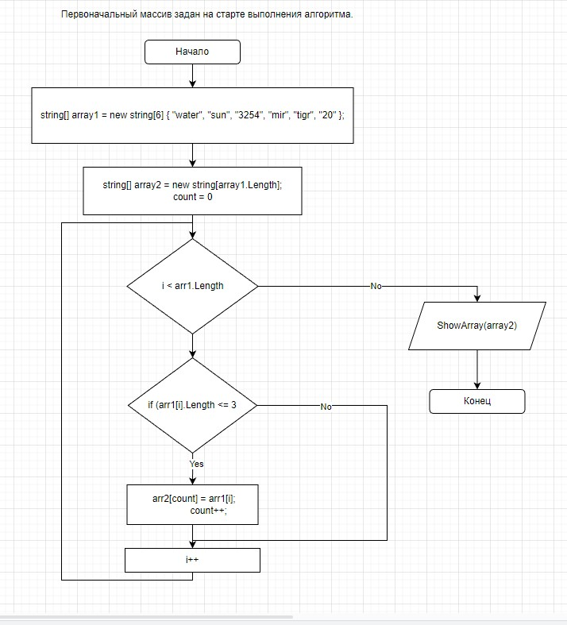

# Задача:
Написать программу, которая из имеющегося массива строк формирует новый массив из строк, длина которых меньше, либо равна 3 символам. Первоначальный массив можно ввести с клавиатуры, либо задать на старте выполнения алгоритма. При решении не рекомендуется пользоваться коллекциями, лучше обойтись исключительно массивами.

Примеры:
[“Hello”, “2”, “world”, “:-)”] → [“2”, “:-)”]

[“1234”, “1567”, “-2”, “computer science”] → [“-2”]

[“Russia”, “Denmark”, “Kazan”] → []

Описания решения: Есть массив из строк, через функцию(TransformationArrayWhen3chart) берем каждую строку массива сравниваем её если строка меньше, либо равна 3 символам тогда записывает ее в новый массив с пощью переменной(count) и с помощью функции(ShowArray) показываем элементы в новом массиве.

Блок схема программы  
